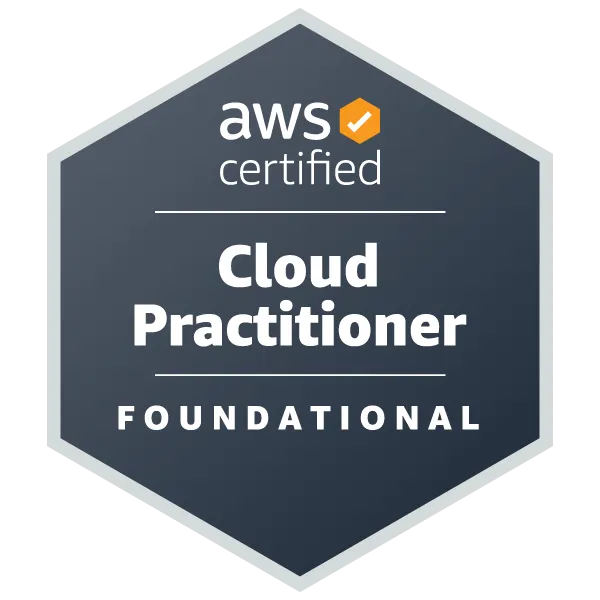

  
  <h1 style="font-size: 1.75rem; font-weight: 700; line-height: 1.3; margin: 0; text-align: left;">AWS Certified Solutions Architect</h1>

* **Estado:** 🟢 Activo
* **Obtención:** 2024-02-07
* **Expiración:** 2027-02-07
* **ID Credencial:** 194d0ba60bc34814a3ef0941931f721d
* **Verificación:** [Verificar en AWS](https://aws.amazon.com/verification)

<!--more-->

Certificación que valida una comprensión general de la plataforma AWS Cloud. Cubre conceptos básicos de la nube, seguridad y cumplimiento dentro de AWS, tecnologías principales, así como estrategias de facturación y precios. Es la base fundamental para el diseño de arquitecturas en la nube.

