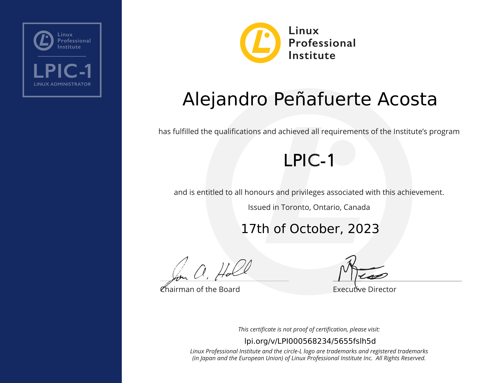

* **Estado:** 🟢 Activo
* **Obtención:** 2023-10-17
* **Expiración:** 2028-10-17
* **ID Credencial:** LPI000568234/5655fslh5d
* **Verificación:** [Validar en LPI](https://lpi.org/v/LPI000568234/5655fslh5d)

<!--more-->

Esta certificación de nivel profesional avala mi capacidad para realizar tareas de mantenimiento en la línea de comandos, instalar y configurar un equipo con Linux y configurar la red básica. Cubre el manejo de paquetes (Debian/RPM), cuotas de disco, permisos de archivos y jerarquía del sistema de archivos (FHS).

