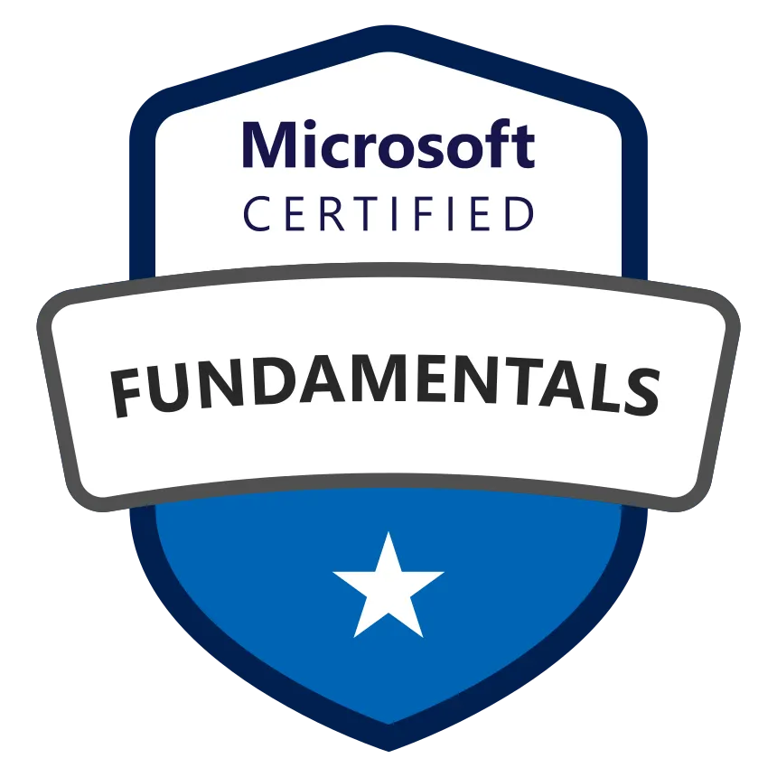
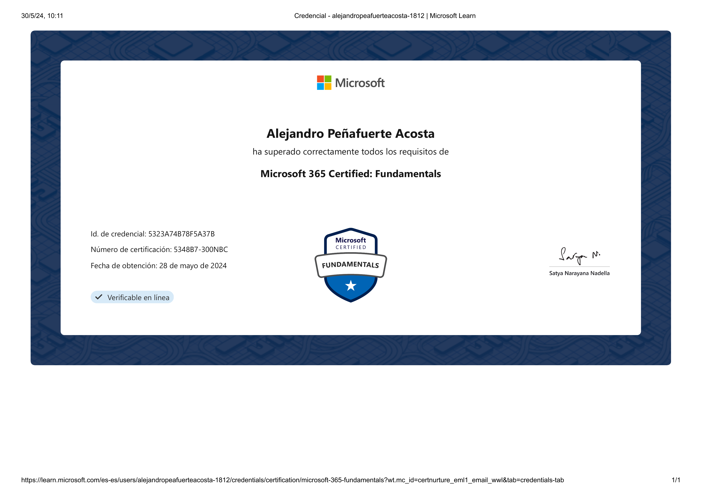

  
  <h1 style="font-size: 1.75rem; font-weight: 700; line-height: 1.3; margin: 0; text-align: left;">Microsoft Certified: Azure Administrator</h1>

* **Estado:** 🟢 Activo
* **Obtención:** 2024-05-28
* **Expiración:** No expira
* **ID Credencial:** 5323A74B78F5A37B
* **Verificación:** [Verificar en Microsoft Learn](https://learn.microsoft.com/api/credentials/share/es-es/AlejandroPeafuerteAcosta-1812/5323A74B78F5A37B?sharingId=327C2A589C83401F)

<!--more-->

Este certificado demuestra conocimiento sobre los beneficios de adoptar servicios en la nube, el modelo de nube de Software como Servicio (SaaS) y la implementación de soluciones de Microsoft 365. Incluye conceptos de seguridad, cumplimiento, privacidad y confianza en el entorno Microsoft.

