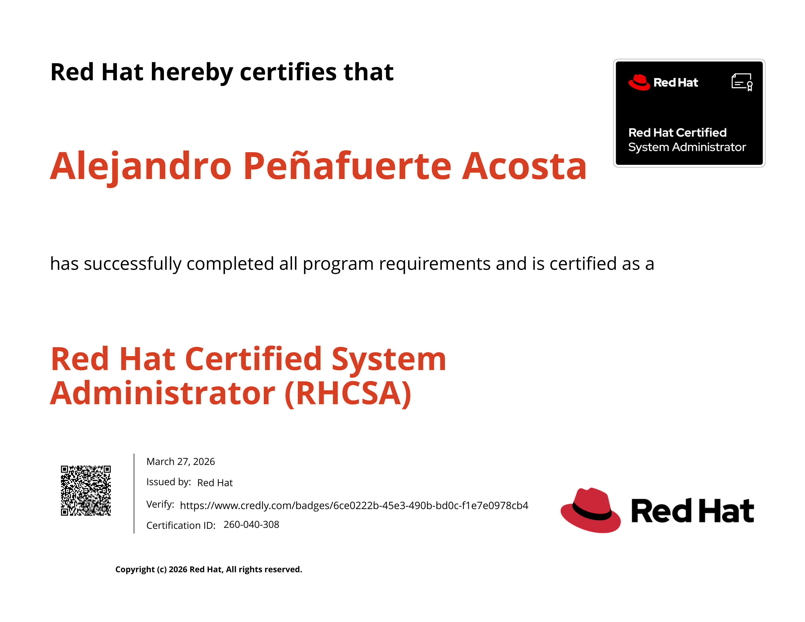

  
  <h1 style="font-size: 1.75rem; font-weight: 700; line-height: 1.3; margin: 0; text-align: left;">RHCSA: Red Hat Certified System Administrator</h1>

* **Estado:** 🟢 Activo
* **Obtención:** 2026-03-27
* **Expiración:** 2029-03-27
* **ID Credencial:** 260-040-308
* **Verificación:** [Verificar en Red Hat](https://rhtapps.redhat.com/verify?certId=260-040-308)

Esta certificación valida mis habilidades fundamentales en la administración de sistemas Linux en entornos Red Hat Enterprise Linux (RHEL), incluyendo la configuración de almacenamiento, gestión de usuarios, seguridad básica (SELinux) y automatización de tareas.

